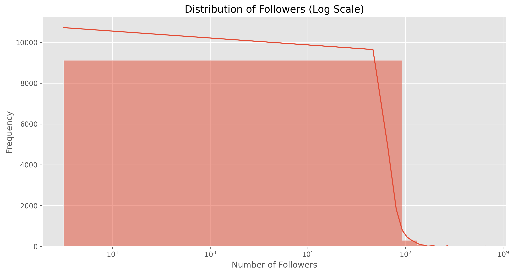
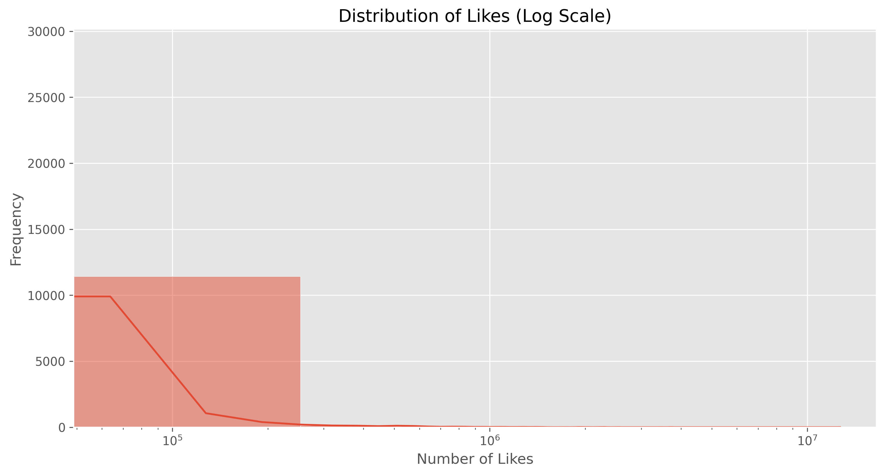
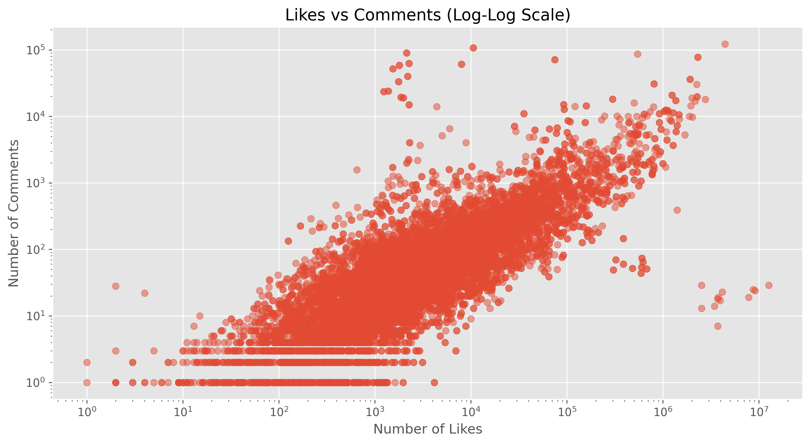
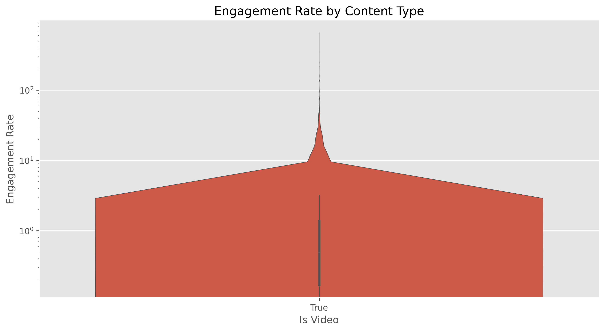

# Instagram Influencer Analysis Project

## Project Overview

This project implements a machine learning pipeline for analyzing Instagram influencer data. It covers the main stages of a ML workflow, from data preparation to model deployment, within the constraints of limited time and resources.

## About Dataset

Data Type: Instagram Account Posts Data
Last Updated: February 2024

Fields:
1. owner_id: Integer (Unique identifier for the owner of the Instagram account)
2. owner_username: String (Username of the owner of the Instagram account)
3. shortcode: String (Unique identifier for the post)
4. is_video: Boolean (Indicator if the post is a video or not)
5. caption: String (Caption text accompanying the post)
6. comments: Integer (Number of comments on the post)
7. likes: Integer (Number of likes on the post)
8. created_at: Integer (Timestamp indicating the creation time of the post)
9. location: String (Location associated with the post, if any)
10. imageUrl: String (URL of the image associated with the post)
11. multiple_images: Boolean (Indicator if the post contains multiple images)
12. username: String (Username of the Instagram account)
13. followers: Integer (Number of followers of the Instagram account)
14. following: Integer (Number of accounts the Instagram account is following)

## Pipeline Stages

### 1. Data Preparation and Preprocessing

- **Data Loading**: The `DataLoader` class reads the CSV file and performs basic validations.
- **Data Preprocessing**: The `DataPreprocessor` class cleans and transforms the raw data, handling missing values and converting data types.
- **Data Normalization**: The `DataNormalizer` class standardizes numeric features and encodes categorical variables.
- **Image Feature Extraction**: The `ImageFeatureExtractor` class processes image URLs to extract basic visual features like dominant colors, brightness, and texture.

#### Unit Testing

I implemented unit tests for the data preparation stage to ensure the reliability and correctness of these crucial initial steps. The tests cover:

- Data loading
- Data preprocessing
- Basic feature creation
- Image feature extraction
- Data normalization

The test scripts are located in the `tests` directory and can be run using the `main_test.py` script.

### 2. Basic Feature Creation

The `BasicFeatureCreator` class adds derived features to the dataset, including:
- Time-based features (post age, hour of day, day of week)
- Engagement metrics (total engagement, engagement rate)
- Content-based features (caption length, hashtag count)

### 3. Exploratory Data Analysis (EDA)

The `ExploratoryDataAnalysis` class performs comprehensive analysis of the data, including:
- User influence analysis
- Viral content analysis
- Content feature analysis

Visualizations are generated to show distributions and relationships within the data:


*Figure 1: Distribution of follower counts across users (Log Scale)*


*Figure 2: Relationship between engagement rate and follower count (Log-Log Scale)*


*Figure 3: Distribution of likes across posts (Log Scale)*


*Figure 4: Relationship between likes and comments (Log-Log Scale)*


*Figure 5: Engagement rate distribution by number of hashtags*


*Figure 6: Engagement rate distribution by content type (video vs. non-video)*

Key features of the EDA:
- Log scales are used to handle the wide range of values in follower counts, likes, and engagement rates.
- Relationships between different engagement metrics (likes, comments, followers) are explored.
- The impact of content features (number of hashtags, video vs. non-video) on engagement is analyzed.

### 4. Feature Engineering

The `FeatureEngineer` class creates user-level features including:
- Engagement metrics (average likes, comments, engagement rate)
- Content style features (video ratio, average caption length)
- Audience metrics (follower-following ratio)

### 5. Modeling

Three models were developed to analyze different aspects of influencer data:

1. **Community Detection Model:** 
   - Uses graph-based techniques to identify influencer communities based on shared hashtags.
   - Implements the Louvain method for community detection.
   - Provides visualization of the community structure.

   
   *Figure 5: Visualization of detected influencer communities*

2. **Influential Users Model:** 
   - Uses a Random Forest Classifier to predict influential users.
   - Defines influential users as those in the top 25% of follower counts.
   - Includes feature importance analysis.

   
   *Figure 6: Feature importance for predicting influential users*

3. **Viral Content Model:** 
   - Predicts the likelihood of content going viral using a Random Forest Classifier.
   - Defines viral content as posts in the top 10% of likes.
   - Uses content-specific features and engagement metrics.

   
   *Figure 7: Feature importance for predicting viral content*

### 6. Deployment (Docker)

The project is containerized using Docker:
- Dockerfile for building the application image
- `run_models.py` script as the entry point for the container
- Volume mounts for data and visualization outputs

## Setup and Usage

1. Clone the repository
2. Install Docker
3. Build the Docker image:
   ```
   docker build -t instagram-analysis .
   ```
4. Run the analysis:
   ```
   docker run -v /path/to/dataset:/app/dataset -v /path/to/visualization:/app/visualization instagram-analysis
   ```
## Final Thoughts
Throughout the development of this project, some features were conceptualized but couldn't be fully implemented due to time constraints. I believe it's valuable to discuss these here, as they reflect my thought process and vision for the project's potential.

#### Image Hashing and Advanced Image Analysis
One of the most promising yet challenging aspects was the implementation of perceptual hashing (pHash) for image analysis. While the groundwork for this feature is present in the codebase, several technical hurdles prevented its full realization:

- URL-based Image Processing: Reading images from URLs proved to be more complex than anticipated, especially when dealing with a large volume of data. Issues with timeouts, rate limiting, and varying image formats would need to be addressed for robust implementation.
- Computational Intensity: Generating and comparing perceptual hashes for a large dataset is computationally expensive. Optimizing this process for efficiency while maintaining accuracy would require significant additional development time.
- Integration with Existing Features: Incorporating pHash-based similarity metrics into our existing feature set and models would necessitate a substantial refactoring of our data pipeline and model architectures.

Despite these challenges, I chose to keep the image hashing code in the project. This decision was made to demonstrate the intended direction of the analysis. With additional time, these features could be refined to offer valuable insights into content similarity and trends.

#### Dockerfile and Containerization
The Dockerfile included in the project represents an effort to containerize the application, although it may not be fully functional in its current state. Some issues that would need to be addressed include:

- Ensuring all dependencies are correctly specified and installed
- Properly setting up the environment within the container
- Handling data persistence and volume mounting for datasets

Retaining the Dockerfile in the project, even in its unfinished state, serves multiple purposes:

It showcases awareness of containerization's critical role in contemporary data science practices.
It lays the groundwork for future refinement and full implementation of a containerized environment.
It exemplifies a comprehensive approach to project design, extending beyond code to encompass deployment considerations and scalability planning.

While time constraints prevented the full implementation of these advanced features, their inclusion in the codebase serves to illustrate the project's potential for growth and sophistication. The focus on maintaining a structured pipeline and a comprehensive project architecture was prioritized over perfecting individual components.
This approach not only showcases my problem-solving process and technical aspirations but also leaves the project in a state where future developments can be more readily incorporated. It underscores the importance of balancing immediate functionality with long-term scalability and feature expansion in data science projects.